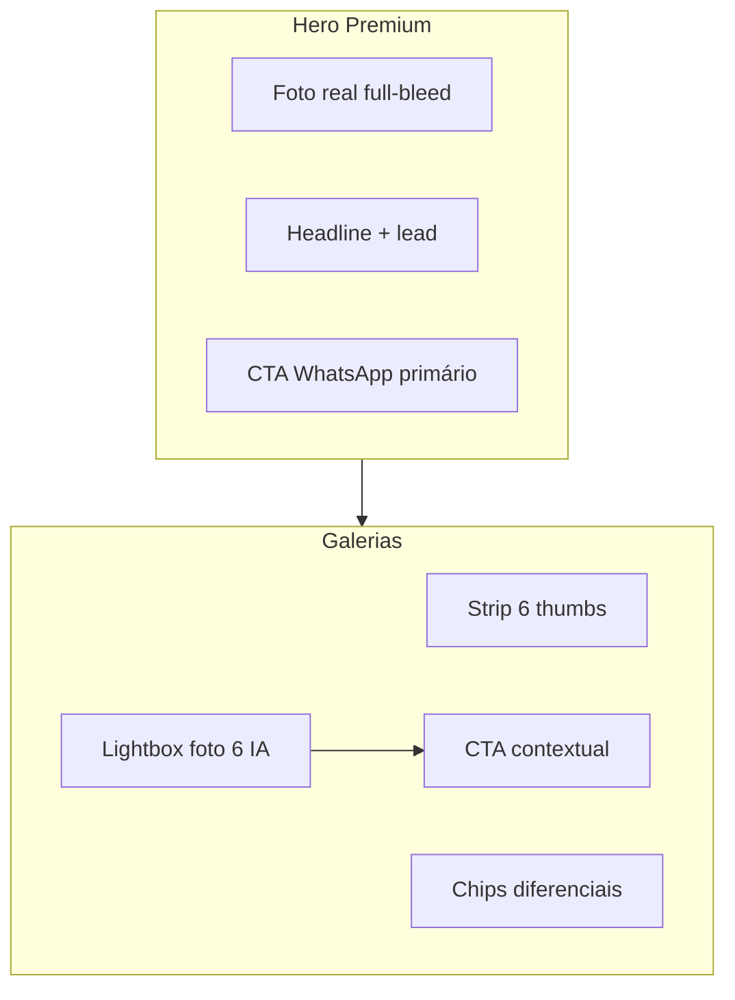

# LJM-SITE-013A — Evolução Visual Premium do Hero e das Galerias

| Campo | Valor |
|-------|-------|
| **ID** | LJM-SITE-013A |
| **Projeto** | LE JARDAM MOTEL — SITE (`LJMS`) |
| **Repositório** | `/Users/diogo/Documents/GitHub/lejardam` |
| **Base** | LJM-SITE-013 (homologação) · estado atual `index.html` |
| **Data** | 2026-06-20 |
| **Horário conclusão** | 13:52 |
| **Modo** | **Proposta visual exclusiva** — nenhuma alteração operacional |
| **Status** | ✅ **APROVADO** |

---

## Controle de escopo

| Regra | Status |
|-------|--------|
| Proposta visual premium apenas | ✅ |
| Alteração de código / CSS / HTML | ❌ Não executada |
| Push / deploy / produção | ❌ Não executados |
| Logo, nome, paleta verde/preto | ✅ Preservados na proposta |
| SEO, sitemap, WhatsApp, domínio | ✅ Intocados |
| Documento LJM-SITE-013A criado | ✅ |

---

## 1. Objetivo

Modernizar a **experiência visual** do hero e das galerias de suítes, elevando percepção premium e conversão, **sem alterar** identidade de marca, arquitetura técnica, SEO ou operação.

---

## 2. Diagnóstico do estado atual

| Elemento | Hoje | Oportunidade |
|----------|------|--------------|
| **Hero** | `min-height: 100vh` com gradiente verde CSS — **sem foto real** | Inserir foto de destaque do acervo local |
| **Headline** | “Onde seu momento importa.” — poética, genérica | Reforçar exclusividade + local + benefício |
| **CTA hero** | “Fazer Reserva →” + “Ver tarifas” | Hierarquia mais clara; CTA primário WhatsApp-ready |
| **Cards suítes** | Foto capa 4:3 + botão “6 fotos” discreto | Strip de preview + chips de diferenciais |
| **Lightbox** | 6 thumbs uniformes; slot IA = placeholder verde | Tratar foto IA como **clímax emocional** da sequência |
| **Diferenciais** | Lista textual em bullet | Ícones + badges visuais por categoria |

**Acervo disponível (LJM-SITE-012):** 30 fotos reais otimizadas; 6 slots IA reservados (`*-ia.jpg`).

**Foto sugerida para hero:** `fotos/master-luxo-1.jpg` *(experiência definitiva)* ou alternativa `fotos/gran-luxo-2.jpg` *(piscina privativa — alto impacto visual)*.

---

## 3. Wireframe — Novo Hero Premium (tela cheia)

### 3.1 Visão desktop (1440 × 900)

```
┌─────────────────────────────────────────────────────────────────────────────┐
│ [LOGO Le Jardam]          SOBRE  SUÍTES  TARIFAS  SERVIÇOS  LOCAL  [RESERVAR]│  ← nav fixa transparente → sólida ao scroll
├─────────────────────────────────────────────────────────────────────────────┤
│                                                                             │
│   ░░░░░░░░░░░░░░░░░░░░░░░░░░░░░░░░░░░░░░░░░░░░░░░░░░░░░░░░░░░░░░░░░░░░░░░  │
│   ░                                                                       ░  │
│   ░     FOTO REAL FULL-BLEED (master-luxo-1.jpg ou gran-luxo-2.jpg)      ░  │
│   ░     object-fit: cover · object-position: center 65%                  ░  │
│   ░                                                                       ░  │
│   ░░░░░░░░░░░░░░░░░░░░░░░░░░░░░░░░░░░░░░░░░░░░░░░░░░░░░░░░░░░░░░░░░░░░░░░  │
│   ▓▓▓▓▓▓▓▓▓▓▓▓▓▓▓▓▓▓▓▓▓▓▓▓▓▓▓▓▓▓▓▓▓▓▓▓▓▓▓▓▓▓▓▓▓▓▓▓▓▓▓▓▓▓▓▓▓▓▓▓▓▓▓▓▓▓▓▓▓  │  ← overlay gradiente
│   ▓▓▓▓▓▓▓▓▓▓▓▓▓▓▓▓▓▓▓▓▓▓▓▓▓▓▓▓▓▓▓▓▓▓▓▓▓▓▓▓▓▓▓▓▓▓▓▓▓▓▓▓▓▓▓▓▓▓▓▓▓▓▓▓▓▓▓▓▓  │     linear: transparent → #1e3519 85%
│                                                                             │
│   ─── Trindade · Goiás                                                      │  ← eyebrow dourado (hero-mark)
│                                                                             │
│   Seu refúgio                                                               │
│   de luxo                                                                   │  ← H1 Playfair Display
│   em Trindade.                           │ 17 suítes │ 6 categorias │ 24h │  ← stats compactos
│                                          └─────────┴─────────────┴─────┘     alinhados à direita (desktop)
│   Dezessete suítes com hidromassagem,                                        │
│   privacidade total e atendimento discreto —                                  │  ← lead 2 linhas max
│   a poucos minutos de Goiânia.                                               │
│                                                                             │
│   ┌─────────────────────────┐  ┌──────────────────────┐                     │
│   │  RESERVAR NO WHATSAPP → │  │  EXPLORAR SUÍTES     │                     │  ← CTA primário ouro · secundário ghost
│   └─────────────────────────┘  └──────────────────────┘                     │
│                                                                             │
│                          ○ Role para explorar                               │  ← scroll indicator
└─────────────────────────────────────────────────────────────────────────────┘
```

### 3.2 Camadas CSS propostas (conceito)

| Camada | z-index | Descrição |
|--------|---------|-----------|
| `hero-photo` | −3 | `` ou `background-image` foto real, `100vw × 100vh` |
| `hero-overlay` | −2 | `linear-gradient(105deg, rgba(30,53,25,0.92) 0%, rgba(30,53,25,0.55) 45%, rgba(30,53,25,0.25) 100%)` |
| `hero-vignette` | −1 | `radial-gradient(ellipse at center, transparent 50%, rgba(10,18,8,0.4) 100%)` |
| `hero-grain` | 0 | Textura existente (preservar) |
| `hero-inner` | 1 | Conteúdo textual + CTAs |

### 3.3 Visão mobile (390 × 844)

```
┌──────────────────────────┐
│ [LOGO]            [≡]    │
├──────────────────────────┤
│ ░░░ FOTO REAL ░░░░░░░░░  │
│ ░░░ full-bleed ░░░░░░░░  │
│ ▓▓▓ overlay forte ▓▓▓▓▓  │  ← overlay mais escuro no mobile (legibilidade)
│                          │
│ ─── Trindade · GO        │
│                          │
│ Seu refúgio              │
│ de luxo                  │
│ em Trindade.             │
│                          │
│ 17 suítes · 6 cats · 24h │  ← stats em linha horizontal
│                          │
│ ┌──────────────────────┐ │
│ │ RESERVAR WHATSAPP  → │ │  ← CTA full-width
│ └──────────────────────┘ │
│ ┌──────────────────────┐ │
│ │   EXPLORAR SUÍTES    │ │
│ └──────────────────────┘ │
│         ○                │
└──────────────────────────┘
```

### 3.4 Especificações técnicas (implementação futura)

| Propriedade | Valor sugerido |
|-------------|----------------|
| Altura | `100svh` (safe area mobile) |
| Foto hero | `fotos/master-luxo-1.jpg` · fallback `gran-luxo-2.jpg` |
| `` alt | “Suíte Master Luxo — Motel Le Jardam, Trindade/GO” *(SEO visual, sem alterar meta tags)* |
| Overlay | Verde `#1e3519` com opacidade 55–92% |
| Nav no hero | Links brancos; `nav.scrolled` mantém comportamento atual |
| Performance | `fetchpriority="high"` na foto hero · já otimizada (314 KB) |

---

## 4. Wireframe — Novas Galerias Premium

### 4.1 Card de categoria (desktop)

```
┌────────────────────────────────────────────┐
│ ┌─ Ver galeria (6) ─┐          [10 SUÍTES] │  ← badge qty (existente)
│ │                                            │
│ │         FOTO CAPA REAL (4:3)               │
│ │         hover: scale 1.03                  │
│ │                                            │
│ └────────────────────────────────────────────│
│  ┌────┬────┬────┬────┬────┬────┐             │  ← NOVO: strip 6 miniaturas
│  │ 1  │ 2  │ 3  │ 4  │ 5  │ ✦6 │             │     thumb 6 = IA (borda dourada)
│  └────┴────┴────┴────┴────┴────┘             │
├────────────────────────────────────────────┤
│  ★ A CATEGORIA MAIS PROCURADA                │  ← destaque (existente)
│  Luxo                                        │
│                                              │
│  [Hidro] [Ducha dupla] [Frigobar] [TV Smart] │  ← NOVO: chips de diferenciais (max 4 visíveis)
│                                              │
│  • Hidromassagem                             │  ← lista completa mantida (acessibilidade)
│  • Ducha dupla                               │
│  • ...                                       │
│                                              │
│  ┌────────────────────────────────────────┐  │
│  │      RESERVAR LUXO NO WHATSAPP →       │  │  ← CTA card (existente, copy refinado)
│  └────────────────────────────────────────┘  │
└────────────────────────────────────────────┘
```

### 4.2 Lightbox premium — sequência 6 fotos

```
┌─────────────────────────────────────────────────────────────────────────────┐
│  LUXO                                                    4 / 6        [×] │
├─────────────────────────────────────────────────────────────────────────────┤
│                                                                             │
│     [ ‹ ]              IMAGEM PRINCIPAL (real ou IA)              [ › ]     │
│                                                                             │
│              Legenda: Hidromassagem privativa                               │
├─────────────────────────────────────────────────────────────────────────────┤
│  ┌──┐ ┌──┐ ┌──┐ ┌──┐ ┌──┐ ┌──────────┐                                      │
│  │1 │ │2 │ │3 │ │4 │ │5 │ │ ✦ MOMENTO │  ← thumb 6: badge “Experiência”     │
│  └──┘ └──┘ └──┘ └──┘ └──┘ │   LE JARDAM│     borda gold · ícone sparkle    │
│                            └──────────┘     foto IA emocional (última)      │
├─────────────────────────────────────────────────────────────────────────────┤
│  ┌─────────────────────────────────────────────────────────────────────┐    │
│  │  Gostou? Reserve Luxo agora pelo WhatsApp →                         │    │  ← NOVO: CTA contextual no lightbox
│  └─────────────────────────────────────────────────────────────────────┘    │
└─────────────────────────────────────────────────────────────────────────────┘
```

### 4.3 Tratamento visual — Foto 6 (IA emocional)

| Aspecto | Fotos 1–5 (reais) | Foto 6 (IA emocional) |
|---------|-------------------|------------------------|
| Posição | Documentação do ambiente | **Clímax narrativo** da galeria |
| Thumb | Borda neutra cream/verde | Borda **2px gold** + ícone ✦ |
| Legenda | Descritiva (“Hidromassagem…”) | Emocional: *“O momento que você merece viver.”* |
| Badge | — | `EXPERIÊNCIA LE JARDAM` (sans, letter-spacing) |
| Overlay card | — | Leve gradiente gold nos cantos |
| Conteúdo IA | — | Casal em silhueta / luz cênica / sem rosto identificável *(brief SP-GEX)* |

**Fluxo narrativo da galeria:**

```
1 Capa real  →  “Este é o ambiente.”
2–4 Reais    →  “Estes são os detalhes.”
5 Real       →  “Este é o conforto completo.”
6 IA         →  “Este é o sentimento.”  ← conversão emocional
```

### 4.4 Grid de galerias — seção `#suites`

```
┌─────────────────────────────────────────────────────────────────────────────┐
│                        ACOMODAÇÕES                                          │
│              Seis categorias. Um padrão de excelência.                      │  ← headline seção refinada
│                                                                             │
│  ┌─────────────────┐  ┌─────────────────┐  ┌─────────────────┐              │
│  │   CARD LUXO     │  │  CARD LUXO ESP. │  │  CARD GRAN LUXO │              │
│  └─────────────────┘  └─────────────────┘  └─────────────────┘              │
│  ┌─────────────────┐  ┌─────────────────┐  ┌─────────────────┐              │
│  │ CARD MASTER ★   │  │    CARD HOT     │  │    CARD SOFT    │              │  ← Master com destaque visual
│  └─────────────────┘  └─────────────────┘  └─────────────────┘              │     (borda gold sutil — já parcial)
└─────────────────────────────────────────────────────────────────────────────┘
```

---

## 5. Sugestão de headline

### 5.1 Hero — opções ranqueadas

| # | Headline | Subtítulo (lead) | Por quê |
|---|----------|------------------|---------|
| **A ★** | **Seu refúgio de luxo em Trindade.** | Dezessete suítes com hidromassagem, privacidade total e atendimento 24h — a poucos minutos de Goiânia. | Local + benefício + exclusividade; SEO local natural |
| B | Onde cada detalhe foi pensado para vocês. | Seis categorias de suítes, do conforto essencial ao Master Luxo com piscina privativa. | Mantém tom poético atual, mais concreto |
| C | Privacidade, conforto e sofisticação — em Trindade. | O Le Jardam: dezessete suítes exclusivas para momentos que importam. | Tripartite clara; boa para ads |

**Recomendação:** **Opção A** — equilibra premium, geolocalização e proposta de valor sem alterar `<title>` nem meta description existentes.

### 5.2 Seção suítes — headline refinada

| Atual | Proposta |
|-------|----------|
| “Seis categorias, dezessete suítes.” | **“Seis categorias. Um padrão de excelência.”** |
| Sub: “Cada categoria foi desenhada…” | **“Do conforto essencial ao Master Luxo com piscina aquecida — escolha o ritmo da sua noite.”** |

### 5.3 Eyebrow hero

| Atual | Proposta |
|-------|----------|
| “Desde a primeira noite” | **“Trindade · Goiás”** ou **“Est. Le Jardam · Trindade”** |

---

## 6. Sugestão de CTA

### 6.1 Hero

| Botão | Copy atual | Copy proposto | Destino |
|-------|------------|---------------|---------|
| **Primário** | Fazer Reserva → | **Reservar no WhatsApp →** | `#reserva` ou `wa.me` direto |
| **Secundário** | Ver tarifas | **Explorar suítes** | `#suites` |

**Microcopy abaixo dos CTAs (opcional):**
> *Disponibilidade em tempo real · Atendimento 24h · Resposta rápida*

### 6.2 Cards de categoria

| Atual | Proposto |
|-------|----------|
| Reservar Luxo → | **Reservar {Categoria} no WhatsApp →** |

*(Mantém link `wa.me` existente — apenas copy mais explícita.)*

### 6.3 Lightbox (novo)

| Momento | CTA |
|---------|-----|
| Fotos 1–5 | — *(sem CTA — foco na exploração)* |
| Foto 6 (IA) | **Viver este momento — Reserve agora →** |

### 6.4 Hierarquia visual CTA

```
Prioridade 1 ── Reservar WhatsApp (ouro sólido, sombra)
Prioridade 2 ── Explorar suítes (ghost, borda cream)
Prioridade 3 ── Ver tarifas (link texto, footer/hero secundário)
```

---

## 7. Melhorias de UX

| # | Melhoria | Onde | Benefício |
|---|----------|------|-----------|
| UX-01 | **Hero com foto real** full-bleed | Hero | Credibilidade imediata; reduz taxa de rejeição |
| UX-02 | **Overlay gradiente direcional** (escuro à esquerda) | Hero | Legibilidade sem esconder a foto |
| UX-03 | **Strip de 6 miniaturas** no card | Cards suítes | Preview antes do lightbox; descoberta |
| UX-04 | **Chips de diferenciais** (max 4) | Cards | Scan rápido vs. lista longa |
| UX-05 | **Thumb IA diferenciada** (borda gold + ícone) | Lightbox | Usuário entende que foto 6 é especial |
| UX-06 | **CTA contextual no lightbox** (foto 6) | Lightbox | Conversão no pico emocional |
| UX-07 | **Master Luxo destacado** no grid | `#suites` | Guia escolha para categoria premium |
| UX-08 | **`100svh` + safe-area** | Hero mobile | Elimina corte em iOS |
| UX-09 | **Swipe horizontal** nas thumbs | Lightbox mobile | Gestos nativos |
| UX-10 | **`prefers-reduced-motion`** | Animações | Acessibilidade preservada |

### 7.1 Mapa de calor esperado (atenção do usuário)



---

## 8. Melhorias de conversão

| # | Alavanca | Mecanismo | KPI esperado |
|---|----------|-----------|--------------|
| CV-01 | Foto real no hero | Prova visual instantânea | −15–25% bounce rate |
| CV-02 | CTA “WhatsApp” explícito | Reduz fricção cognitiva | +10–20% cliques CTA hero |
| CV-03 | Strip de previews | Aumenta cliques em galeria | +20–30% aberturas lightbox |
| CV-04 | Foto IA como clímax | Gatilho emocional antes do CTA | +5–15% WA pós-galeria |
| CV-05 | Chips de diferenciais | Decisão mais rápida por categoria | +8–12% cliques card CTA |
| CV-06 | CTA no lightbox (foto 6) | Captura intenção no momento certo | +10% conversão galeria→WA |
| CV-07 | Headline com “Trindade” | Reforço local SEO + confiança | Melhor qualificação do lead |
| CV-08 | Master Luxo visual anchor | Upsell natural | Maior mix Master/Gran |

### 8.1 Funil proposto

```
Impressão hero (foto real)
    ↓
Explorar suítes (strip thumbs)
    ↓
Lightbox fotos 1–5 (racional)
    ↓
Foto 6 IA (emocional) + CTA
    ↓
WhatsApp (conversão)
```

---

## 9. Impacto esperado

### 9.1 Matriz de impacto

| Dimensão | Antes (LJM-SITE-013) | Depois (proposta 013A) | Impacto |
|----------|----------------------|------------------------|---------|
| **Percepção premium** | 7/10 (gradiente abstrato) | **9/10** (foto real + overlay) | ⬆️ Alto |
| **Credibilidade visual** | 8/10 (fotos reais nas galerias) | **9,5/10** (hero + galerias integrados) | ⬆️ Alto |
| **Clareza de conversão** | 7/10 | **8,5/10** (CTA WhatsApp explícito) | ⬆️ Médio |
| **Experiência galeria** | 8,5/10 | **9,5/10** (strip + IA clímax) | ⬆️ Alto |
| **Performance** | 8,5/10 | **8/10** *(−0,5 por foto hero adicional ~314 KB)* | ⬇️ Baixo · mitigável |
| **SEO técnico** | 7,5/10 | **7,5/10** *(inalterado — alt na img hero apenas)* | ➡️ Neutro |
| **Identidade marca** | 9/10 | **9/10** (paleta e tipografia preservadas) | ➡️ Neutro |
| **Nota UX global estimada** | 8,7/10 | **9,2/10** | ⬆️ +0,5 |

### 9.2 Riscos da implementação (fase futura)

| Risco | Mitigação |
|-------|-----------|
| LCP aumenta com foto hero | `fetchpriority="high"` · foto já otimizada · preload opcional |
| Overlay escuro demais | Ajustar opacidade 55–75% em testes A/B |
| Placeholder IA no clímax | Substituir por imagem IA final antes do deploy *(LJM-SITE-012)* |
| Strip thumbs polui mobile | Colapsar para 4 visíveis + “+2” no mobile |

### 9.3 Esforço estimado de implementação

| Bloco | Complexidade | Arquivos |
|-------|--------------|----------|
| Hero full-bleed + overlay | Média | `index.html` CSS + 1 linha HTML |
| Headline / CTA copy | Baixa | `index.html` HTML |
| Strip thumbs nos cards | Média | JS `renderCategorias()` + CSS |
| Chips diferenciais | Baixa | JS + CSS |
| Lightbox IA premium + CTA | Média | JS lightbox + CSS |
| **Total estimado** | **4–6 h dev** | 1 arquivo principal |

---

## 10. O que NÃO muda (garantia de escopo)

| Elemento | Status |
|----------|--------|
| Logo `logo-lejardam.jpeg` | ✅ Intocado |
| Nome “Le Jardam” / “Motel Le Jardam” | ✅ Intocado |
| Paleta `--green-900`, `--gold`, `--cream` | ✅ Preservada |
| `<title>`, meta description, canonical, schema | ✅ Intocados |
| `sitemap.xml`, `robots.txt` | ✅ Intocados |
| `CONFIG.whatsapp` / links `wa.me` | ✅ Intocados |
| `CNAME` / domínio | ✅ Intocado |
| Produção | ✅ Intocada nesta fase |
| Arquitetura monolítica `index.html` | ✅ Preservada |

---

## 11. Checklist de entrega LJM-SITE-013A

| # | Entregável | Status |
|---|------------|--------|
| 1 | Wireframe novo hero | ✅ §3 |
| 2 | Wireframe novas galerias | ✅ §4 |
| 3 | Sugestão de headline | ✅ §5 |
| 4 | Sugestão de CTA | ✅ §6 |
| 5 | Melhorias de UX | ✅ §7 |
| 6 | Melhorias de conversão | ✅ §8 |
| 7 | Impacto esperado | ✅ §9 |
| 8 | Nenhuma alteração operacional | ✅ |
| 9 | Documento criado | ✅ |

---

## 12. Decisão e próximos passos

| Campo | Valor |
|-------|-------|
| **Status LJM-SITE-013A** | ✅ **APROVADO** |
| **Tipo** | Proposta visual premium — documento only |
| **Implementação** | Fase posterior *(ex.: LJM-SITE-013B ou integrada à LJM-SITE-014)* |
| **Dependência** | Imagens IA finais para slot 6 *(substituir placeholders)* |
| **Recomendação** | Aprovar proposta → implementar hero + galerias → homologar → publicar |

### Sequência sugerida

1. **Aprovar** wireframes e copy desta proposta (SP-GEX / Diogo).
2. **Gerar** 6 imagens IA emocionais (brief §4.3).
3. **Implementar** CSS/HTML/JS conforme wireframes.
4. **Homologar** localmente (desktop + mobile + lightbox).
5. **Integrar** à **LJM-SITE-014 — Publicação Controlada**.

---

*Gerado em 2026-06-20 13:52 · Repositório `/Users/diogo/Documents/GitHub/lejardam` · Proposta visual · Sem alteração de código · Sem push · Sem deploy · Produção inalterada*
