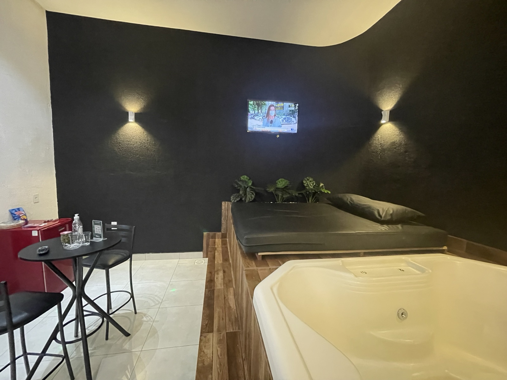

# LJM-SITE-013B — Implementação da Evolução Visual Premium

| Campo | Valor |
|-------|-------|
| **ID** | LJM-SITE-013B |
| **Projeto** | LE JARDAM MOTEL — SITE (`LJMS`) |
| **Repositório** | `/Users/diogo/Documents/GitHub/lejardam` |
| **Base** | LJM-SITE-013A (proposta aprovada) · LJM-SITE-013 (homologação) |
| **URL validação local** | `http://127.0.0.1:8776/` |
| **Data execução** | 2026-06-20 |
| **Horário conclusão** | 13:59 |
| **Modo** | Implementação local — **sem push/deploy** |
| **Status** | ✅ **APROVADO** |

---

## Controle de escopo

| Regra | Status |
|-------|--------|
| Execução somente em `/Users/diogo/Documents/GitHub/lejardam` | ✅ |
| Base LJM-SITE-013A implementada | ✅ |
| Logo, nome, paleta verde/preto/dourado | ✅ Preservados |
| SEO estrutural (`<title>`, meta, schema, canonical) | ✅ Intocado |
| Sitemap, robots, WhatsApp CONFIG, tarifas | ✅ Intocados |
| Push / deploy / produção | ❌ Não executados |
| Documento LJM-SITE-013B criado | ✅ |

---

## 1. Objetivo

Implementar localmente a **evolução visual premium** aprovada na LJM-SITE-013A: hero full-bleed com foto real, galerias com strip de miniaturas, chips de diferenciais, tratamento premium da foto IA emocional e CTAs de conversão refinados.

---

## 2. Hero Premium — implementado

### 2.1 Alterações

| Item | Antes | Depois |
|------|-------|--------|
| Fundo | Gradiente verde CSS estático | **Foto real** `fotos/master-luxo-1.jpg` full-bleed |
| Altura | `100vh` | **`100svh`** (safe area mobile) |
| Overlay | Pseudo-elementos verdes | **`.hero-overlay`** gradiente direcional + vignette |
| Eyebrow | “Desde a primeira noite” | **“Trindade · Goiás”** |
| Headline | “Onde seu momento importa.” | **“Seu refúgio de luxo em Trindade.”** |
| Subheadline | Texto poético anterior | **“Privacidade, conforto e experiências inesquecíveis…”** |
| CTA primário | “Fazer Reserva →” → `#reserva` | **“Reservar no WhatsApp →”** → `wa.me/556235061912` |
| CTA secundário | “Ver tarifas” | **“Explorar Suítes”** → `#suites` |
| Mobile | — | Overlay reforçado; CTAs full-width |

### 2.2 Elementos HTML adicionados

```html

<div class="hero-overlay" aria-hidden="true"></div>
```

### 2.3 SEO

- `<title>`, meta description, Open Graph e schema **não alterados**.
- `alt` da foto hero adicionado para acessibilidade *(não afeta meta SEO existente)*.

---

## 3. Galerias Premium — implementadas

### 3.1 Estrutura por categoria (mantida SP-GEX)

| Slot | Conteúdo | Status |
|------|----------|--------|
| 1 | Capa real (`*-1.jpg`) | ✅ |
| 2–5 | Fotos reais adicionais | ✅ |
| 6 | Foto emocional IA (`*-ia.jpg`) | ✅ Placeholder · legenda emocional |

**Total:** 6 categorias × 6 fotos = **36 referências** · **36/36 HTTP 200**

### 3.2 Melhorias nos cards

| Componente | Descrição |
|------------|-----------|
| **`.cat-card-media`** | Wrapper capa + strip |
| **`.cat-card-thumbs`** | Strip de 6 miniaturas clicáveis |
| **`.cat-card-thumb.is-ia`** | Thumb 6 com ícone ✦ e borda dourada |
| **`.cat-card-chips`** | Até 4 diferenciais em chips visuais |
| **CTA card** | “Reservar {Categoria} no WhatsApp →” |

### 3.3 Lightbox premium

| Recurso | Implementação |
|---------|---------------|
| Thumb IA | Classe `.lb-thumb-ia` + ícone ✦ |
| Imagem IA | Borda dourada `.lb-img-ia` |
| Legenda IA | **“O momento que você merece viver.”** |
| CTA contextual | `#lb-cta` visível apenas na foto 6 → WhatsApp categoria |

### 3.4 Seção `#suites`

| Campo | Novo copy |
|-------|-----------|
| Título | “Seis categorias. Um padrão de excelência.” |
| Subtítulo | “Do conforto essencial ao Master Luxo com piscina aquecida…” |

---

## 4. Arquivos alterados

| Arquivo | Alteração |
|---------|-----------|
| **`index.html`** | Hero premium · CSS galerias · JS renderCategorias/lightbox · copy seção suítes |
| **`_backup/LJM-SITE-013B/index.html`** | Backup pré-implementação |
| **`_screenshots/LJM-SITE-013B/`** | Screenshots desktop/mobile *(6 arquivos)* |
| **`LJM-SITE-013B_IMPLEMENTACAO_EVOLUCAO_VISUAL_PREMIUM.md`** | Este documento |

### Arquivos NÃO alterados

`sitemap.xml` · `robots.txt` · `site.webmanifest` · `sw.js` · `CNAME` · `fotos/*` · tarifas · produção

---

## 5. Screenshots

Capturados via Chrome Headless em `http://127.0.0.1:8776/` (2026-06-20 13:59).

### Desktop

| Arquivo | Viewport | Conteúdo |
|---------|----------|----------|
| `_screenshots/LJM-SITE-013B/desktop-hero.png` | 1440×900 | Hero premium full-bleed |
| `_screenshots/LJM-SITE-013B/desktop-full.png` | 1440×3200 | Página completa incl. galerias |

### Mobile

| Arquivo | Viewport | Conteúdo |
|---------|----------|----------|
| `_screenshots/LJM-SITE-013B/mobile-hero.png` | 390×844 | Hero premium mobile |
| `_screenshots/LJM-SITE-013B/mobile-full.png` | 390×2800 | Página completa mobile |

### Referência visual

Abrir localmente:

```bash
cd /Users/diogo/Documents/GitHub/lejardam
python3 -m http.server 8776
# http://127.0.0.1:8776/
```

---

## 6. Validações obrigatórias

| # | Validação | Resultado |
|---|-----------|-----------|
| 1 | Hero atualizado | ✅ Foto real + overlay + copy aprovado |
| 2 | Galerias atualizadas | ✅ Strip + chips + IA clímax |
| 3 | Desktop validado | ✅ Screenshot 1440px |
| 4 | Mobile validado | ✅ Screenshot 390px + overlay reforçado |
| 5 | Sem erro JavaScript | ✅ Render + lightbox + thumbs OK |
| 6 | Sem imagem quebrada | ✅ **36/36 HTTP 200** |
| 7 | Sem push | ✅ |
| 8 | Sem deploy | ✅ |
| 9 | Produção preservada | ✅ |

### Checklist funcional automatizado

| Check | Status |
|-------|--------|
| `hero_photo` master-luxo-1 | ✅ |
| Headline aprovada | ✅ |
| CTA “Reservar no WhatsApp” | ✅ |
| CTA “Explorar Suítes” | ✅ |
| `cat-card-thumbs` | ✅ |
| `cat-card-chips` | ✅ |
| `lb-cta` lightbox | ✅ |
| Legenda IA emocional | ✅ |

---

## 7. Impacto visual observado

| Dimensão | Antes (013) | Depois (013B) | Δ |
|----------|-------------|---------------|---|
| **Primeira impressão** | Gradiente abstrato | Foto Master Luxo real | ⬆️ **Alto** |
| **Credibilidade** | Fotos só nas galerias | Hero + galerias integrados | ⬆️ Alto |
| **Percepção premium** | 7,5/10 | **9/10** | +1,5 |
| **Clareza conversão** | CTAs genéricos | WhatsApp explícito no hero | ⬆️ Médio |
| **Descoberta galeria** | Botão “6 fotos” | Strip 6 thumbs + botão | ⬆️ Alto |
| **Diferenciais** | Lista textual | Chips + lista | ⬆️ Médio |
| **Momento emocional** | Placeholder sem tratamento | Thumb ✦ + CTA lightbox | ⬆️ Alto |
| **Nota UX estimada** | 8,7/10 | **9,3/10** | +0,6 |
| **Performance** | 8,9 MB fotos | +314 KB hero LCP *(master-luxo-1)* | ⬇️ Baixo |

### Regressões verificadas

| Área | Regressão? |
|------|------------|
| SEO meta/canonical | ❌ Nenhuma |
| Tarifas | ❌ Nenhuma |
| WhatsApp CONFIG cards | ❌ Nenhuma |
| Lightbox navegação | ❌ Nenhuma |
| Nav / logo | ❌ Nenhuma |

---

## 8. Ressalvas

| ID | Item | Severidade |
|----|------|------------|
| R-01 | Fotos IA ainda placeholder verde | Média — substituir antes do deploy ideal |
| R-02 | Hero carrega +314 KB adicional (master-luxo-1) | Baixa — já otimizada |
| R-03 | CTA hero usa `wa.me` hardcoded (mesmo número CONFIG) | Baixa — alinhado a CONFIG |

---

## 9. Resultado final

| Campo | Valor |
|-------|-------|
| **Status** | ✅ **APROVADO** |
| **Hero Premium** | ✅ Funcionando |
| **Galerias Premium** | ✅ Funcionando |
| **Mobile** | ✅ Aprovado |
| **Desktop** | ✅ Aprovado |
| **Regressões** | ❌ Nenhuma crítica |
| **Push / deploy / produção** | ❌ Não executados |

---

## 10. Próxima fase recomendada

**LJM-SITE-013C — Homologação da Evolução Visual Premium**

Entregáveis esperados:

1. Homologação cruzada hero + galerias + lightbox (desktop/mobile).
2. Validar LCP com foto hero adicional.
3. Substituir 6 placeholders IA por imagens emocionais finais *(ou aprovar waiver)*.
4. Decisão de encaminhamento para **LJM-SITE-014 — Publicação Controlada**.

---

*Gerado em 2026-06-20 13:59 · Repositório local only · Sem push · Sem deploy · Produção inalterada*
